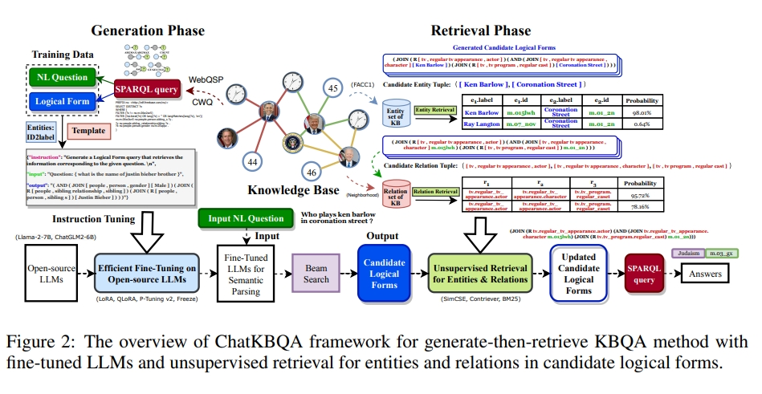

# CHATKBQA: 知识检索QA问答

> 论文名称：CHATKBQA: A GENERATE-THEN-RETRIEVE FRAMEWORK FOR KNOWLEDGE BASE QUESTION ANSWERING WITH FINE-TUNED LARGE LANGUAGE MODELS
> 
> 论文地址：https://arxiv.org/pdf/2310.08975v1.pdf
> 
> 论文 Github地址：https://github.com/LHRLAB/ChatKBQA

## 一、论文动机

知识问答（KBQA）旨在通过检索大型知识库（KB）得出问题答案，该研究通常分为两个部分：知识检索和语义解析。但是目前KBQA仍然存在3个主要挑战：

1. 知识检索效率低下；
2. 检索错误影响语义解析结果；
3. 先前KBQA方法的复杂性。

## 二、论文思路

在大型语言模型 (LLM) 时代，作者引入了「ChatKBQA，这是一种新型生成再检索KBQA 框架」，它建立在微调开源LLM的基础上，例如 Llama-2、ChatGLM2 和 Baichuan2。

ChatKBQA提出首先使用微调的LLM生成逻辑形式，然后通过无监督检索方法检索和替换实体、关系，这直接地改进了生成和检索。

## 三、实验结果

ChatKBQA在标准KBQA数据集、WebQSP和ComplexWebQuestions (CWQ)上实现了最先进的性能。本文研究还提供了一种将LLMs与知识图谱（KG）相结合的新范式，以实现可解释的、基于知识的问答。

## 致谢

- CHATKBQA: A GENERATE-THEN-RETRIEVE FRAMEWORK FOR KNOWLEDGE BASE QUESTION ANSWERING WITH FINE-TUNED LARGE LANGUAGE MODELS：https://arxiv.org/pdf/2310.08975v1.pdf

