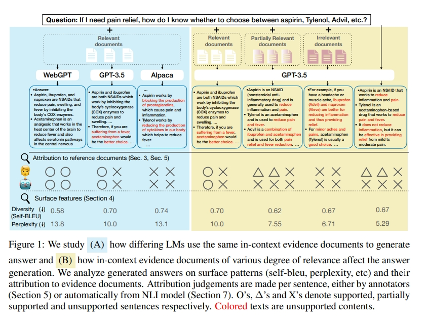

# RAG4LFAQ：论检索增强对长篇问题回答影响

> 论文名称：UNDERSTANDING RETRIEVAL AUGMENTATION FORLONG-FORM QUESTION ANSWERING
> 
> 论文地址：https://arxiv.org/pdf/2310.12150.pdf
> 

## 一、动机

### 1.1 LLMs 的 大模型幻觉问题

当模型生成的**文本不遵循原文（Faithfulness）**或者**不符合事实（Factualness）**，我们就可以认为模型出现了幻觉的问题。

### 1.2 大模型幻觉的缓解方法：检索增强语言模型 RAG

大模型幻觉出现原因 在于 大模型 对于 自己不熟悉的问题，容易 生成的**文本不遵循原文（Faithfulness）**或者**不符合事实（Factualness）**的答案。

研究者 发现 通过 检索增强语言模型 RAG 可以 缓解 大模型幻觉问题。

### 1.3 检索增强语言模型 RAG 弊端

对于 复杂的长文本生成任务，RAG检索 召回 的 上下文，并不一定 都和答案相关内容，这就导致 这些和答案相关内容容易左右 LLMs 对 问题答案生成效果。

## 二、论文研究内容

本论文主要研究 **检索对LFQA答案生成的影响**，这是一个复杂的长文本生成任务。提出了两个受控的研究设置（如图所示）：

1. 固定LLMs并变化证据文档，
2. 固定证据文档并变化LLMs；

3. 研究了生成答案的各种属性（如流利性、长度、方差），重点研究了生成的长格式答案对上下文证据文件的归因；
4. 研究检索增强如何影响LMs的长时间、知识丰富的文本生成提供了新的见解；

## 三、论文结论

- 结论一：检索是一个重要的组成部分，但证据文档应谨慎添加到语言模型中

> eg： 证据文档中呈现信息的顺序将影响生成答案时信息呈现的顺序。

- 结论二：当检索到的文档缺乏足够的信息或证据来回答问题时，会更频繁发生归因错误

## 四、个人小结

该论文的一个关键见解是，语言模型需要更好的多文档摘要和综合能力。这是因为检索器可能会引入不兼容或相互矛盾的文档，而语言模型应该具有处理这些问题以生成更忠实答案的能力。

正如其他最近的研究所展示的，致力于改进检索器是构建更好的检索增强系统和减少归因错误的关键。

## 致谢

- UNDERSTANDING RETRIEVAL AUGMENTATION FORLONG-FORM QUESTION ANSWERING：https://arxiv.org/pdf/2310.12150.pdf
- 【LM应用】理解检索增强对长篇问题回答的影响：https://zhuanlan.zhihu.com/p/662322026

